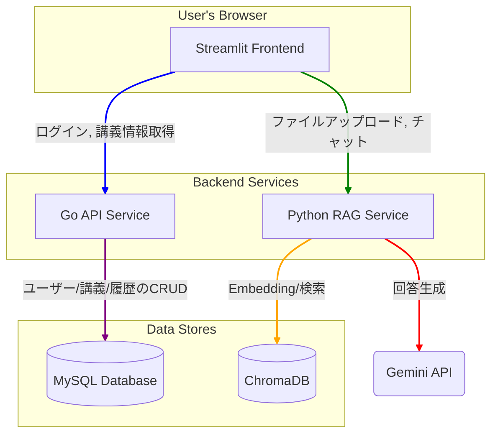

# OpenRAG: 講義支援マルチテナントRAGチャットボット

OpenRAGは、大学の講義ごとに特化した知識ベースを持つ、スケーラブルなRAG（Retrieval-Augmented Generation）チャットボットシステムです。

## ✨ 特徴

- **マルチテナント対応**: 講義ごとに独立したベクトルデータベースとシステムプロンプトを設定可能。
- **スケーラブルなアーキテクチャ**: GoとPythonによるマイクロサービス構成で、関心事を分離し、メンテナンス性とスケーラビリティを向上。
- **認証機能**: JWTベースの認証により、セキュアなAPIアクセスを実現。
- **永続化**: 講義データ、チャット履歴、ベクトルDBはすべて永続化されます。
- **簡単なセットアップ**: Docker Composeにより、ワンコマンドで全サービスを起動可能。

## 🏛️ アーキテクチャ

このプロジェクトは、4つのコンテナ化されたサービスで構成されています。



- **`frontend-streamlit` (Port 8501)**: ユーザーインターフェース。
- **`api-go` (Port 8000)**: 認証、ユーザー・講義・チャット履歴管理を担当する高速APIサーバー。
- **`rag-python` (Port 8001)**: ドキュメント処理、Embedding、LLM連携など、計算集約的なAI処理を担当。
- **`db` (Port 3306)**: MySQLデータベース。ユーザー情報や講義設定などを保存。

## 🛠️ 技術スタック

- **フロントエンド**: Streamlit
- **バックエンド**:
  - **API Gateway/認証**: Go, Gin
  - **RAGコア**: Python, FastAPI, LangChain, Sentence Transformers
- **データベース**: MySQL, ChromaDB
- **LLM**: Google Gemini
- **コンテナ化**: Docker, Docker Compose

## 🚀 セットアップと起動

### 前提条件

- Docker
- Docker Compose
- Google Gemini API キー

### 手順

1.  **リポジトリのクローン:**
    ```bash
    git clone <repository_url>
    cd OpenRAG
    ```

2.  **環境変数の設定:**
    - `.env` ファイルをプロジェクトルートに作成します（リポジトリには含まれていません）。
    - 以下の内容を参考に、ご自身の環境に合わせて値を設定してください。特に `GEMINI_API_KEY` は必須です。
      ```env
      # .env
      MYSQL_DATABASE=open_rag_db
      MYSQL_USER=rag_user
      MYSQL_PASSWORD=rag_password
      MYSQL_ROOT_PASSWORD=rag_root_password
      DB_SOURCE=rag_user:rag_password@tcp(db:3306)/open_rag_db?parseTime=true
      SERVER_ADDRESS=0.0.0.0:8000
      JWT_SECRET_KEY=your-super-secret-jwt-key
      GEMINI_API_KEY="YOUR_GEMINI_API_KEY_HERE"
      API_GO_URL=http://api-go:8000
      API_PYTHON_RAG_URL=http://rag-python:8001
      ```

3.  **データディレクトリの作成:**
    - データを永続化するためのディレクトリをホスト側に作成します。
    ```bash
    mkdir -p data/mysql data/chroma .cache/huggingface
    ```

4.  **Dockerイメージのビルド:**
    ```bash
    docker compose build
    ```

5.  **Dockerコンテナの起動:**
    ```bash
    docker compose up -d
    ```
    - `-d` オプションでバックグラウンドで起動します。ログを確認する場合は `docker compose logs -f` を実行します。

### アクセス

- **Streamlit UI**: `http://localhost:8501`
- **Go API (Swagger等なし)**: `http://localhost:8000`
- **Python RAG API (Docs)**: `http://localhost:8001/docs`

## 停止

```bash
docker compose down
```
- コンテナを停止し、ネットワークを削除します。
- ボリューム（`data/` 内のデータ）は削除されません。データを完全に削除したい場合は `docker compose down -v` を使用してください。